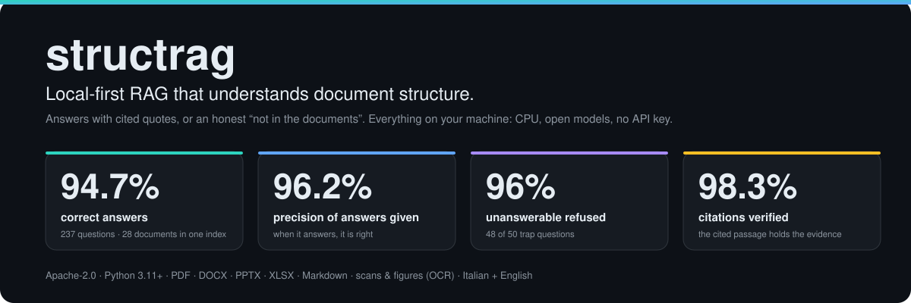
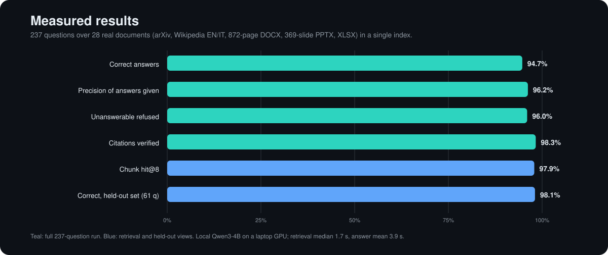
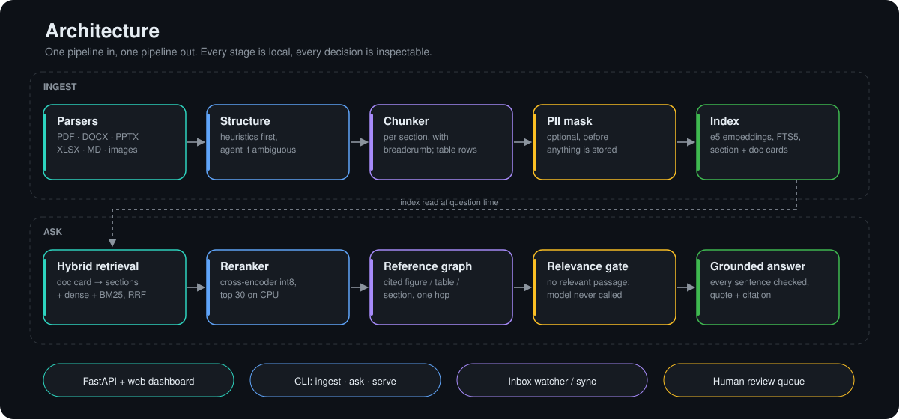
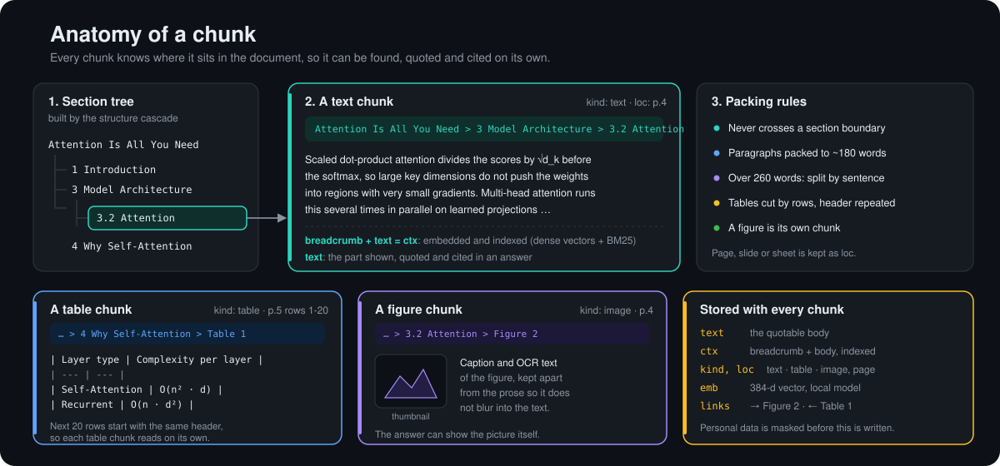
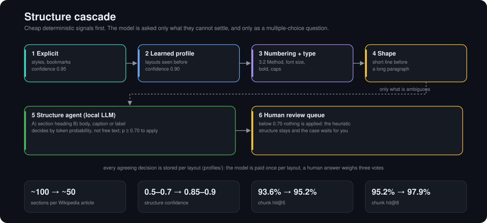
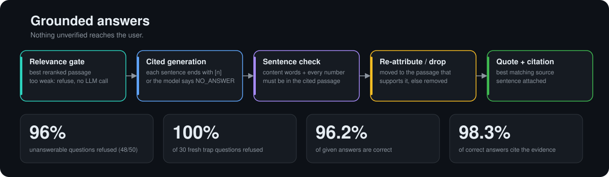

<div align="center">



</div>

**structrag reads documents the way a person does: it finds the chapters, sections and tables first, then answers from
the right place, with a quote and a citation for every sentence.** When the documents do not contain the answer it says
so, instead of inventing one. It runs entirely on your machine: open-source models on CPU, no API key, no data leaving the
laptop, and optional masking of personal data before anything is stored.

## Results

Measured on **237 questions over 28 real documents in one shared index**: arXiv papers, Wikipedia in English and Italian,
an 872-page DOCX handbook, a 369-slide PPTX, financial spreadsheets, scans and charts. 50 of the questions are
traps whose answer is not in any document.



| what | result |
|---|---|
| Correct answers | **94.7%** (98.1% on the 61-question set of documents never used to develop the parsers) |
| Precision of the answers given | **96.2%**: when structrag answers, it is right |
| Unanswerable questions refused | **96%** (48 of 50); 30 of 30 of the newest traps refused |
| Citations that contain the evidence | **98.3%** of correct answers |
| Right chunk retrieved in the top 8 | **97.9%** (95.2% in the top 5, 89.8% in the top 3) |
| Speed on a laptop | retrieval median **1.7 s**, full answer mean **3.9 s** (Qwen3-4B, 6 GB GPU); embeddings and reranking run on CPU |
| Tests | **93** automated tests |

## The dashboard

`structrag serve` opens a local dashboard (http://127.0.0.1:8000) with everything in one window. It is a front end to the same FastAPI service (REST + streaming chat) that other programs can call.

**Ask.** Type a question, optionally restricting it to some documents (click documents in the left list). You get the answer
with `[n]` citations, the **exact sentence of the source that backs it** (green quote), the section path and page, and the line
*grounded: 1 source checked*. Under each source, `→ Table 1 · attention (p.5)` is a reference of that passage: one click opens
the passage it leads to, with its own references, right in the answer (for a question on attention complexity, the table with the figures).
If the documents do not contain the answer, you get a refusal in the language of the question and the closest passages.

**Overview.** The state of the corpus at a glance: documents, sections, chunks, words, documents awaiting review, documents by
status and format, masked personal data by type, and **which documents cite which** (here, the Italian Wikipedia articles
pointing at each other).

**Review queue.** This is where the structure agent stops and asks you. Each card shows the ambiguous case, the options, and the
model's confidence for each (`A=0.52, B=0.47`). Nothing below 0.70 was applied. Click the right option: your answer is applied,
the document is rebuilt, and it counts three times as much as a model decision when the layout is learned.

**The rest of the left column.** *New chat* and the chat history; a drop zone (PDF, DOCX, PPTX, XLSX, MD) that ingests while
you watch; the document list with a status badge (`ok`, `review`, `needs_ocr`) and a delete button; **Sync inbox**, which picks up
new, edited, renamed and deleted files in `data/inbox`. The top bar shows whether the chat model answers, which embedder and reranker
run, whether PII masking is on, and that everything is local.

**How one question flows through it.** The question is rewritten standalone if it is a follow-up, then the hybrid retrieval and the
reranker pick passages, the reference graph adds what they cite, and the relevance gate decides whether the model is called at all.
Its answer is cut into sentences; each one must be supported by the passage it cites or it is dropped. What survives reaches the
screen with its quote and references. See the architecture below for each stage.

## Architecture



Two pipelines share one SQLite index. **Ingest** turns a file into sections and chunks that keep their place in the
document. **Ask** retrieves, verifies and cites. Every stage is local and every decision is stored, so you can see why an
answer looks the way it does.

### Every component, what it is for, what it buys you

| component | what it does | why it matters / measured impact |
|---|---|---|
| **Parsers** `parsers/` | PDF (with bookmarks and typography), DOCX, PPTX, XLSX, Markdown, images; OCR for scanned pages (RapidOCR, ~3 s/page) and optional vision model for charts | One index over very different inputs: the benchmark mixes an 872-page DOCX, a 369-slide PPTX, spreadsheets, and PDFs with figures |
| **Structure cascade** `structure/heuristics.py` | Finds headings and their level from explicit styles, learned layouts, numbering (`3.2 Method`), font size and shape, each with a confidence | Chunks follow the document's real sections instead of arbitrary windows |
| **Structure agent** `structure/resolver.py` | Asks the local LLM a multiple-choice question only for what the heuristics cannot settle (bold-only lines, unclear table header rows) and reads the answer from token probabilities | Sections per Wikipedia article drop from ~100 to ~50 (fewer false titles), structure confidence rises from 0.5-0.7 to 0.85-0.9, chunk hit@8 from 95.2% to 97.9% |
| **Human review queue** `store.py` | A model answer under 0.70 is not applied; it waits for a person, whose answer outweighs three model votes | The model can never silently corrupt a document's structure |
| **Learned profiles** `structure/profiles.py` | Agreeing decisions are stored per layout and applied deterministically next time | The model is paid once per layout, not once per document |
| **Chunker** `chunking.py` | Chunks never cross a section boundary, carry a breadcrumb, and tables are cut by rows with the header repeated | Every chunk is self-describing: hit@1 69%, hit@3 89.8%, hit@5 95.2% |
| **Section and document cards** `summarize.py` | Two-level summaries (lead paragraph plus outline, no model needed) used as routing signals | Hierarchical search: find the right document and section first, then the passage |
| **Hybrid retrieval** `retrieve.py` | Document card, then dense vectors, BM25 (FTS5) and section cards fused with reciprocal rank fusion; small sections are returned whole | Finds the passage by meaning and by exact term (names, numbers, article numbers) |
| **Reranker** `llm/local.py` | Cross-encoder (int8 ONNX) rescoring the top 30 candidates on CPU, ~2 s per query | Puts the evidence first and gives a relevance score the gates below can trust |
| **Reference graph** `links.py` | Edges from explicit references only: `Figure 3`, `Table 2`, `Section 3.2`, `art. 5`, another document by title, arXiv id, DOI or act number; no model involved | Every source in an answer lists what it points to and who points at it, and one click opens that passage |
| **Relevance gate** `chat.py` | If even the best reranked passage is too weak, the model is not called | 96% of unanswerable questions refused, and no tokens wasted on them |
| **Sentence grounding** `grounding.py` | Every sentence must be supported by the passage it cites (content words and every number); it is re-attributed to the right passage or removed; the best matching source sentence is attached as a quote | 96.2% precision of answers given; 98.3% of citations contain the evidence |
| **Calibration** `eval/bench/calibrate.py` | Thresholds fitted on a fit/holdout split of the benchmark; an LLM verifier was tested in five prompt variants (AUC 0.70-0.75, rejecting 17-35% of correct answers) and deliberately left off | Gates chosen from data, not by feel: same accuracy, about 10% lower latency |
| **PII masking** `pii.py` | [rizzo-pii](https://huggingface.co/rizzoaiacademy/rizzo-pii-0.3B) (Italian-first, CPU) replaces names, IBAN, tax code, phone, address, plates with stable placeholders before embedding and storage | Personal data never reaches the index; the same person keeps the same placeholder within a document, so retrieval stays coherent |
| **Sync** `sync.py` | Watches an inbox; detects added, edited, renamed and deleted files by content hash; rebuilds only what changed | An edit re-embeds only the chunks whose text changed; a broken edit never wipes the index |
| **Session memory** `chat.py` | Follow-up questions are rewritten as standalone queries; a rolling summary keeps the conversation | "And the second one?" works |
| **API, dashboard, CLI** `api.py`, `web/`, `cli.py` | FastAPI, a single-file web UI with sources, quotes, figures and the review queue, and a CLI (`ingest`, `ask`, `serve`, `scan`, `watch`, `docs`, `review`, `doctor`) | Usable by a person on day one |
| **Benchmark harness** `eval/bench/` | 237 questions, per-question logs, grader, calibration and verifier tools | Every number in this README is reproducible |

## What a chunk looks like



A chunk is the unit that is indexed, retrieved, quoted and cited. It never crosses a section boundary and carries the path of
its section as a breadcrumb, so a passage still says where it comes from when it is read alone. The breadcrumb plus the text
(`ctx`) is what gets embedded and indexed; the text alone is what an answer quotes. Tables are cut by rows with the header
repeated, and a figure's caption and OCR text become a chunk of their own. Sizes (`chunk_target_words`, `chunk_max_words`,
`table_rows_per_chunk`) are in `config.py`.

## Structure that adapts to the document



Documents do not announce their structure: a bold line may be a heading or an emphasized sentence, a spreadsheet range may
or may not start with its header. structrag resolves the easy cases with cheap deterministic signals and asks the local
model only the leftovers, as a multiple-choice question answered by token probabilities rather than free text. A
confident answer is applied and remembered for that layout; an unsure one is **not applied** and goes to a person. If the
model server is down, ingestion continues with the heuristics and logs a warning.

## Answers you can check



The chat stream emits `status`, `sources`, `final` (`answered`, `text`, `citations[{n, doc, section, loc, evidence, image,
images, via, refs}]`, `claims`, `verdict`). The answer is in the language of the question (Italian or English); a refusal
still shows the closest passages.

## Follow the references

Each source lists what its passage points to (`→ Figure 2 · paper (p.4)`) and what cites it (`← Table 1 · paper (p.5)`).
Clicking opens the target in place, with its section path and its own references, so you can walk from an answer to the
figure or table it relies on. `GET /api/chunks/{id}` returns the same node and `GET /api/graph` the document-level graph
(also in the Overview panel). About 45% of the sources shown in the benchmark carry at least one reference to follow.
Retrieval can also pull a cited passage in, one hop and never chained (`STRUCTRAG_GRAPH=off` disables the graph).

## Quick start

```bash
pip install -e .[local]          # add ,ocr for scans and figures, ,pii for PII masking
structrag serve                  # dashboard on http://127.0.0.1:8000, watches data/inbox
```

The first run downloads the models once (~120 MB embeddings, ~120 MB reranker). Chat needs any local OpenAI-compatible
server (Ollama, llama.cpp `llama-server`, LM Studio): set `STRUCTRAG_BASE_URL` and `STRUCTRAG_CHAT_MODEL`. Without one,
search works and answers wait for the model.

| role | default |
|---|---|
| embeddings | `intfloat/multilingual-e5-small` (MIT, 384-d, Italian + English), ~20 chunks/s on 6 threads |
| reranker | `cross-encoder/mmarco-mMiniLMv2-L12-H384-v1`, int8 (Apache-2.0) |
| chat | any OpenAI-compatible local model; benchmarked with Qwen3-4B Q5 |
| OCR | RapidOCR PP-OCRv5 (ONNX, CPU) |

Useful switches: `STRUCTRAG_GROUNDING=strict|off`, `STRUCTRAG_RERANK=off`, `STRUCTRAG_EMBEDDER=hash` (model-free
lexical fallback), `STRUCTRAG_PII_MODE=mask`, `STRUCTRAG_GRAPH=off`, `STRUCTRAG_VISION_MODEL` /
`STRUCTRAG_VISION_BASE_URL` for chart understanding. Thresholds (`min_relevance`, `min_support`, `agent_accept_prob`) live in
`config.py`.

## Reproduce the numbers

```bash
PYTHONPATH=src python eval/bench/run.py --tag t --agent --answer --llm http://127.0.0.1:8081/v1 \
  --docs docs,docs_blind,docs_blind2 --qa qa.json,qa_blind.json,qa_blind2.json,qa_traps.json,qa_links.json \
  --embedder local --embed-model intfloat/multilingual-e5-small --rerank local
pytest
```

`eval/bench/docs/` (public PDFs and Office files) and the built indexes are not in the repository; `docs_blind*` hold the
public PDFs of the two blind sets, and `make_*_qa.py` and `README.md` in that folder describe the sets. A retrieval *hit* means one chunk contains all the evidence strings; an answer is *correct* when it
contains an accepted value; unanswerable questions must be refused.

**How the numbers were obtained.** The 80-question `qa` set and the 61-question `qa_blind` set guided development; the
61-question `qa_blind2` set was not used to develop the parsers. The answer thresholds were calibrated on the benchmark with a
fit/holdout split. Grading is exact substring matching, which can mark a correct paraphrase as wrong. Figures are for a
28-document index on one machine.

## Project layout

```
src/structrag/
  parsers/        PDF, DOCX, PPTX, XLSX, Markdown, images (OCR, figures)
  structure/      heuristics, LLM agent, learned profiles, section tree
  chunking.py     section-scoped chunks with breadcrumbs, table rows with headers
  retrieve.py     hierarchical hybrid retrieval, graph hops, context budget
  links.py        reference graph (figures, tables, sections, documents)
  grounding.py    per-sentence verification and quotes
  chat.py         relevance gate, cited generation, session memory
  pii.py          personal-data masking before storage
  sync.py         inbox watcher, incremental rebuilds
  store.py        SQLite + FTS5 index, review queue, graph queries
  api.py, web/    FastAPI and the dashboard
eval/bench/       benchmark harness, calibration, question sets
tests/            93 tests
```

## License

Apache-2.0. See `LICENSE`.
